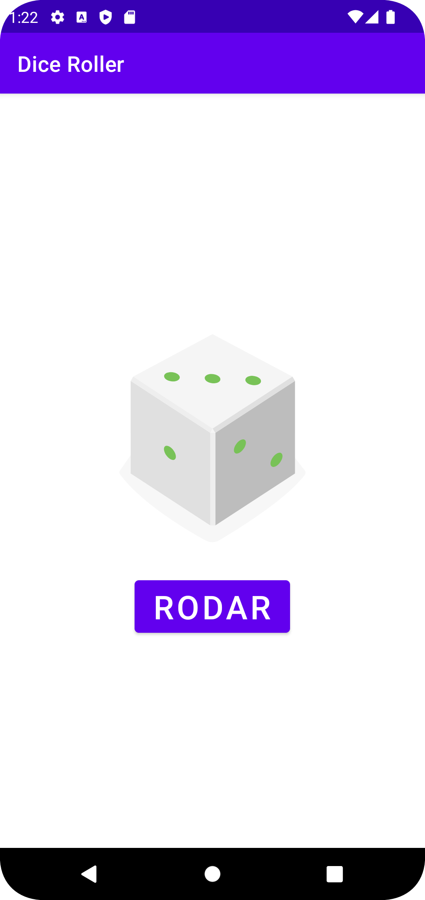
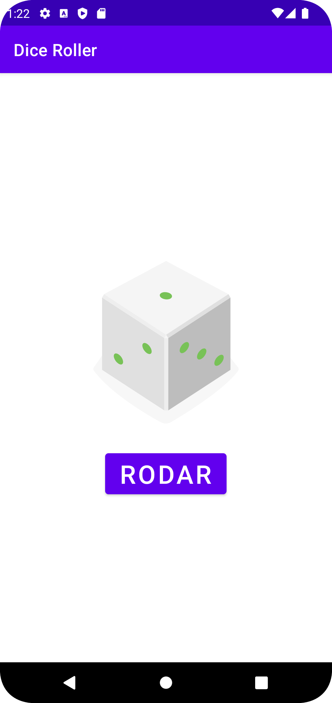

# diceroller

Desenvolvimento de aplicativos android com Kotlin

## Screenshots

    
    
    

## Instalação

Instale diceroller com link: <a href="https://mega.nz/apk/dicerollapp"> diceroller</a>

## Autor

- [@hendapaim](https://www.github.com/hendapaim)